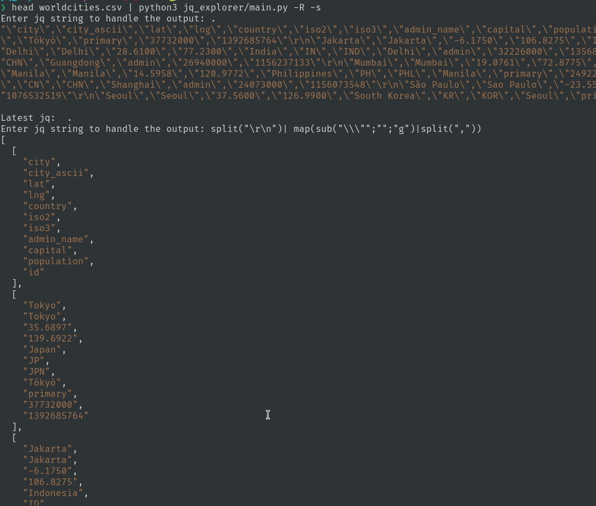

# JQ Explorer

JQ Explorer is a Python script that allows you to interactively explore JSON data using the [jq](https://stedolan.github.io/jq/) command-line tool. It provides a command-line interface where you can enter jq commands and see the results highlighted using the Pygments library.


## Installation

To install and run this script, follow these steps:

1. Clone the repository from GitHub:

```
git clone https://github.com/flavin/jq_explorer.git
```

2. Navigate to the project directory:

```
cd jq_explorer
```

3. Install the required Python packages:

```
pip install -r requirements.txt
```

Please ensure that you have Python and pip installed on your system before following these steps.

## Usage

To run the script, use the following command:

```
echo '{"name": "John", "age": 30, "city": "New York"}' | python jq_explorer/main.py
```

if you have a file `example.json``
```
{
    "employees": [
        {
            "firstName": "John",
            "lastName": "Doe"
        },
        {
            "firstName": "Anna",
            "lastName": "Smith"
        },
        {
            "firstName": "Peter",
            "lastName": "Jones"
        }
    ]
}
```

then you can

```
cat example.json | python jq_explorer/main.py
```

or

```
curl -s https://pokeapi.co/api/v2/pokemon/  | python3 jq_explorer/main.py
```


```
head example.csv | python3 jq_explorer/main.py
```


